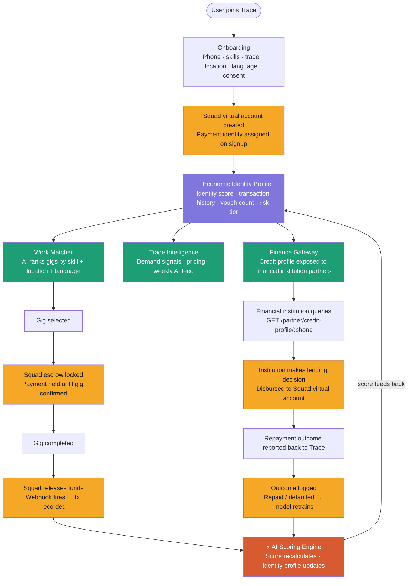

# Trace — System Architecture Documentation
> **Squad Hackathon 3.0 | Challenge 02: Intelligent Economic Platform**
> Version 2.0 | Team Document

---

## System Flow Diagram



---

## Table of Contents
1. [Product Overview](#1-product-overview)
2. [The Problem We Are Solving](#2-the-problem-we-are-solving)
3. [System Philosophy](#3-system-philosophy)
4. [Tech Stack](#4-tech-stack)
5. [Database Design (PostgreSQL)](#5-database-design-postgresql)
6. [API Structure](#6-api-structure)
7. [Core Engines](#7-core-engines)
8. [Squad API Integration](#8-squad-api-integration)
9. [AI & Scoring Layer](#9-ai--scoring-layer)
10. [The Learning Loop](#10-the-learning-loop)
11. [Trade Intelligence Data Sources](#11-trade-intelligence-data-sources)
12. [The Partner API — Financial Institutions](#12-the-partner-api--financial-institutions)
13. [Job Supply Strategy](#13-job-supply-strategy)
14. [Accessibility Strategy](#14-accessibility-strategy)
15. [The Full Data Flow](#15-the-full-data-flow)
16. [Build Order & Team Responsibilities](#16-build-order--team-responsibilities)
17. [Demo Strategy](#17-demo-strategy)
18. [Colour Palette](#18-colour-palette)

---

## 1. Product Overview

**Trace** is an AI-powered economic platform that turns invisible informal economic activity into a verifiable digital identity — giving African traders, gig workers, and job seekers access to financial services they have always been excluded from.

> **Trace does not give loans. Trace builds the digital identity that makes financial institutions come to the user.**

### The Three Pillars

| Pillar | What It Does |
|---|---|
| **Work Matcher** | AI matches gig workers and job seekers to opportunities by skill, location, and language |
| **Trade Intelligence** | Gives informal traders real-time market demand signals and pricing insights |
| **Finance Gateway** | Exposes verified alternative credit profiles to financial institution partners |

### The Spine
Everything feeds into and builds from one central record: **The Economic Identity Profile** — a living, growing portrait of a user's economic activity that gets richer with every transaction, gig, and interaction.

### The Tagline
> *"Your hustle has a footprint. We make it visible."*

### The One-Line Pitch
> *"We don't give them money. We give them the digital identity that makes the money come to them."*

---

## 2. The Problem We Are Solving

- The informal economy provides **up to 70% of employment in sub-Saharan Africa**
- Informal cross-border trade in SADC alone is valued at **$17.6 billion annually**
- Traders are locked out of financial services not by choice — no credit history, no formal documentation, no institutional visibility
- Financial institutions want to lend to this market but have no reliable data on them
- Existing platforms are built for donors and governments, not for the traders themselves

**Trace is the data layer that bridges both sides.**

---

## 3. System Philosophy

> Trace is not a collection of features. It is a **data pipeline.**

Every action a user takes — signing up, completing a gig, receiving a Squad payment, being vouched for by a peer — is a **data event** that flows into their Economic Identity.

The key mental model:
```
User Action → Data Event → Identity Profile Updates → Score Recalculates → New Doors Open
```

### The Golden Rule
> **If the transaction doesn't go through Squad on Trace, it doesn't belong on Trace.**

Every feature, every integration, every partnership must pass this test. The moment transactions escape the platform, the data pipeline breaks and the scoring engine starves.

---

## 4. Tech Stack

| Layer | Technology | Why |
|---|---|---|
| Frontend | React.js (PWA) | Mobile-first, works on low-end Android, no App Store needed |
| Backend | Node.js + Express | REST API, webhook handling, Squad integration, LLM calls |
| Primary Database | PostgreSQL | Relational data, ACID compliance, financial integrity |
| Cache + Queue | Redis + BullMQ | Cache scores, async job queue for score recalculation |
| AI Microservice | Python + FastAPI | Scoring + matching — needs scikit-learn, pandas, numpy |
| Internal Transport | gRPC | Node → Python, faster than REST, type-safe, HTTP/2 |
| Payments | Squad API | Virtual accounts, payment initiation, webhooks, escrow |
| Auth | JWT + OTP (phone-based) | Phone number is the primary identifier, not email |
| Process Manager | PM2 | Keeps Node and Python alive on VPS |
| Reverse Proxy | Nginx (1.13.10+) | Serves React, proxies Node (proxy_pass) and Python (grpc_pass) |

### Service Communication
```
React (client)
    ↓  HTTPS + JWT          ← public REST
Node/Express (server)
    ↓  gRPC + shared secret ← internal, type-safe
Python FastAPI (ai-service)
    ↓
PostgreSQL + Redis
```

### Hybrid AI Approach
- **Python** — credit scoring model and matching algorithm (scikit-learn, pandas)
- **Node** — market intelligence text generation via LLM API call (no extra service needed)

### Directory Structure
```
trace/
├── client/        # React PWA
├── server/        # Node.js + Express
└── ai-service/    # Python FastAPI (gRPC server)
```

### VPS Startup Order
```
1. PostgreSQL   → must be up before Node connects
2. Redis        → must be up before BullMQ initialises
3. Python       → must be up before Node makes gRPC calls
4. Node         → starts last
5. Nginx        → reload config
```

---

## 5. Database Design (PostgreSQL)

### Table 1: `users`
```sql
CREATE TABLE users (
  id                    UUID PRIMARY KEY DEFAULT gen_random_uuid(),
  full_name             VARCHAR(255) NOT NULL,
  phone                 VARCHAR(20) UNIQUE NOT NULL,
  email                 VARCHAR(255),
  password_hash         TEXT NOT NULL,
  role                  TEXT[] DEFAULT '{}',
  state                 VARCHAR(100),
  city                  VARCHAR(100),
  latitude              DECIMAL(9,6),
  longitude             DECIMAL(9,6),
  squad_customer_id     VARCHAR(255),
  virtual_account_no    VARCHAR(50),
  languages             TEXT[] DEFAULT '{}',
  preferred_language    VARCHAR(20) DEFAULT 'en',
  data_sharing_consent  BOOLEAN DEFAULT FALSE,
  is_verified           BOOLEAN DEFAULT FALSE,
  onboarding_complete   BOOLEAN DEFAULT FALSE,
  created_at            TIMESTAMP DEFAULT NOW(),
  updated_at            TIMESTAMP DEFAULT NOW()
);
```

> **`data_sharing_consent`** — user explicitly opts in during onboarding to allow verified financial partners to query their credit profile. Required for Partner API to return data.

> **`preferred_language`** — supports `en`, `yo` (Yoruba), `ha` (Hausa), `ig` (Igbo), `pcm` (Pidgin).

---

### Table 2: `economic_profiles`
```sql
CREATE TABLE economic_profiles (
  id                        UUID PRIMARY KEY DEFAULT gen_random_uuid(),
  user_id                   UUID UNIQUE NOT NULL REFERENCES users(id),
  identity_score            INTEGER DEFAULT 0 CHECK (identity_score BETWEEN 0 AND 100),
  transaction_score         DECIMAL(5,2) DEFAULT 0,
  activity_score            DECIMAL(5,2) DEFAULT 0,
  vouch_score               DECIMAL(5,2) DEFAULT 0,
  profile_completeness      DECIMAL(5,2) DEFAULT 0,
  skills                    TEXT[],
  trade_category            VARCHAR(100),
  years_active              INTEGER,
  is_profile_verified       BOOLEAN DEFAULT FALSE,
  total_transaction_volume  DECIMAL(15,2) DEFAULT 0,
  total_transaction_count   INTEGER DEFAULT 0,
  avg_monthly_volume        DECIMAL(15,2) DEFAULT 0,
  last_transaction_at       TIMESTAMP,
  vouch_count               INTEGER DEFAULT 0,
  verified_vouch_count      INTEGER DEFAULT 0,
  risk_tier                 VARCHAR(10) DEFAULT 'high',
  is_finance_eligible       BOOLEAN DEFAULT FALSE,
  max_recommended_loan      DECIMAL(15,2) DEFAULT 0,
  last_active               TIMESTAMP,
  updated_at                TIMESTAMP DEFAULT NOW()
);
```

---

### Table 3: `transactions`
```sql
CREATE TABLE transactions (
  id                  UUID PRIMARY KEY DEFAULT gen_random_uuid(),
  user_id             UUID NOT NULL REFERENCES users(id),
  counterparty_id     UUID REFERENCES users(id),
  squad_reference     VARCHAR(255) UNIQUE,
  type                VARCHAR(30) NOT NULL,
  category            VARCHAR(50),
  amount              DECIMAL(15,2) NOT NULL,
  currency            VARCHAR(5) DEFAULT 'NGN',
  status              VARCHAR(20) DEFAULT 'pending',
  metadata            JSONB,
  created_at          TIMESTAMP DEFAULT NOW()
);

CREATE INDEX idx_transactions_user_id ON transactions(user_id);
CREATE INDEX idx_transactions_created_at ON transactions(created_at);
```

---

### Table 4: `opportunities`
```sql
CREATE TABLE opportunities (
  id                  UUID PRIMARY KEY DEFAULT gen_random_uuid(),
  posted_by           UUID NOT NULL REFERENCES users(id),
  title               VARCHAR(255) NOT NULL,
  description         TEXT,
  type                VARCHAR(30) NOT NULL,
  skills_required     TEXT[],
  languages_required  TEXT[],
  state               VARCHAR(100),
  city                VARCHAR(100),
  latitude            DECIMAL(9,6),
  longitude           DECIMAL(9,6),
  is_remote           BOOLEAN DEFAULT FALSE,
  pay_min             DECIMAL(15,2),
  pay_max             DECIMAL(15,2),
  currency            VARCHAR(5) DEFAULT 'NGN',
  status              VARCHAR(20) DEFAULT 'open',
  selected_applicant  UUID REFERENCES users(id),
  payment_method      VARCHAR(20) DEFAULT 'squad',
  escrow_reference    VARCHAR(255),
  created_at          TIMESTAMP DEFAULT NOW(),
  updated_at          TIMESTAMP DEFAULT NOW()
);
```

---

### Table 5: `opportunity_applications`
```sql
CREATE TABLE opportunity_applications (
  id              UUID PRIMARY KEY DEFAULT gen_random_uuid(),
  opportunity_id  UUID NOT NULL REFERENCES opportunities(id),
  applicant_id    UUID NOT NULL REFERENCES users(id),
  status          VARCHAR(20) DEFAULT 'pending',
  match_score     DECIMAL(5,2),
  applied_at      TIMESTAMP DEFAULT NOW(),
  UNIQUE(opportunity_id, applicant_id)
);
```

---

### Table 6: `vouches`
```sql
CREATE TABLE vouches (
  id              UUID PRIMARY KEY DEFAULT gen_random_uuid(),
  voucher_id      UUID NOT NULL REFERENCES users(id),
  receiver_id     UUID NOT NULL REFERENCES users(id),
  relationship    VARCHAR(50),
  message         TEXT,
  weight          DECIMAL(3,2) DEFAULT 1.0,
  is_verified     BOOLEAN DEFAULT FALSE,
  created_at      TIMESTAMP DEFAULT NOW(),
  UNIQUE(voucher_id, receiver_id)
);
```

---

### Table 7: `partner_institutions`
```sql
CREATE TABLE partner_institutions (
  id              UUID PRIMARY KEY DEFAULT gen_random_uuid(),
  name            VARCHAR(255) NOT NULL,
  api_key_hash    TEXT NOT NULL,
  is_active       BOOLEAN DEFAULT TRUE,
  query_count     INTEGER DEFAULT 0,
  created_at      TIMESTAMP DEFAULT NOW()
);
```

---

### Table 8: `partner_queries`
```sql
CREATE TABLE partner_queries (
  id              UUID PRIMARY KEY DEFAULT gen_random_uuid(),
  partner_id      UUID NOT NULL REFERENCES partner_institutions(id),
  user_id         UUID NOT NULL REFERENCES users(id),
  queried_at      TIMESTAMP DEFAULT NOW()
);
```

> Every partner query is logged. Users can see who accessed their data and when from their dashboard.

---

### Table 9: `financial_products`
```sql
CREATE TABLE financial_products (
  id                  UUID PRIMARY KEY DEFAULT gen_random_uuid(),
  name                VARCHAR(255) NOT NULL,
  type                VARCHAR(30) NOT NULL,
  min_score_required  INTEGER NOT NULL,
  max_amount          DECIMAL(15,2),
  interest_rate       DECIMAL(5,2),
  tenor_days          INTEGER,
  provider            VARCHAR(100),
  is_active           BOOLEAN DEFAULT TRUE,
  created_at          TIMESTAMP DEFAULT NOW()
);
```

---

### Table 10: `loan_applications`
```sql
CREATE TABLE loan_applications (
  id                            UUID PRIMARY KEY DEFAULT gen_random_uuid(),
  user_id                       UUID NOT NULL REFERENCES users(id),
  product_id                    UUID NOT NULL REFERENCES financial_products(id),
  partner_id                    UUID NOT NULL REFERENCES partner_institutions(id),
  amount_requested              DECIMAL(15,2) NOT NULL,
  amount_approved               DECIMAL(15,2),
  status                        VARCHAR(30) DEFAULT 'pending',
  squad_reference               VARCHAR(255),
  identity_score_at_application INTEGER,
  due_date                      TIMESTAMP,
  repaid_at                     TIMESTAMP,
  repayment_outcome             VARCHAR(20),
  created_at                    TIMESTAMP DEFAULT NOW()
);
```

> **`repayment_outcome`** — reported back by the financial institution. Values: `repaid_on_time`, `repaid_late`, `defaulted`. This is the training label for credit scoring model retraining.

---

### Table 11: `market_intelligence`
```sql
CREATE TABLE market_intelligence (
  id              UUID PRIMARY KEY DEFAULT gen_random_uuid(),
  category        VARCHAR(100) NOT NULL,
  state           VARCHAR(100),
  city            VARCHAR(100),
  period          VARCHAR(20) NOT NULL,
  demand_index    INTEGER,
  avg_tx_value    DECIMAL(15,2),
  tx_count        INTEGER,
  trend           VARCHAR(10),
  insights        TEXT[],
  created_at      TIMESTAMP DEFAULT NOW(),
  UNIQUE(category, state, city, period)
);
```

---

### Table 12: `gig_outcomes`
```sql
CREATE TABLE gig_outcomes (
  id                  UUID PRIMARY KEY DEFAULT gen_random_uuid(),
  opportunity_id      UUID NOT NULL REFERENCES opportunities(id),
  worker_id           UUID NOT NULL REFERENCES users(id),
  employer_id         UUID NOT NULL REFERENCES users(id),
  was_accepted        BOOLEAN,
  was_completed       BOOLEAN,
  employer_rehired    BOOLEAN,
  employer_vouched    BOOLEAN,
  completion_days     INTEGER,
  match_score_at_time DECIMAL(5,2),
  created_at          TIMESTAMP DEFAULT NOW()
);
```

> This is the matching model's training dataset. Every row teaches the AI what a good match looks like.

---

### Relationships Summary
```
users
  ├── economic_profiles (1:1)
  ├── transactions (1:many)
  ├── opportunities posted (1:many)
  ├── opportunity_applications (1:many)
  ├── vouches given (1:many)
  ├── vouches received (1:many)
  └── loan_applications (1:many)

opportunities → opportunity_applications (1:many)
financial_products → loan_applications (1:many)
partner_institutions → partner_queries (1:many)
partner_institutions → loan_applications (1:many)
```

---

## 6. API Structure

All routes prefixed with `/api/v1`

### Auth
```
POST  /auth/register
POST  /auth/login
POST  /auth/verify-phone
POST  /auth/refresh
```

### Profile
```
GET   /profile/:userId
PUT   /profile/:userId
GET   /profile/:userId/score
POST  /profile/vouch
GET   /profile/:userId/vouches
GET   /profile/:userId/data-access-log
```

### Opportunities
```
GET   /opportunities
POST  /opportunities
GET   /opportunities/:id
POST  /opportunities/:id/apply
POST  /opportunities/:id/select/:uid
POST  /opportunities/:id/complete
```

### Finance
```
GET   /finance/eligibility
GET   /finance/products
POST  /finance/loan/apply
GET   /finance/loans
```

### Intelligence
```
GET   /intelligence/feed
GET   /intelligence/:category
```

### Partner API (Financial Institutions)
```
GET   /partner/credit-profile/:phone     ← requires partner API key
POST  /partner/loan-outcome              ← institution reports repayment result
```

### Webhooks
```
POST  /webhooks/squad
```

---

## 7. Core Engines

### Engine 1: Identity Engine
Triggered after every significant event.

1. Fetch transaction aggregates from `transactions`
2. Fetch vouch data from `vouches`
3. Call Python via gRPC → `CalculateScore`
4. Write new score to `economic_profiles`
5. Invalidate Redis cache
6. Notify user if eligibility threshold crossed

### Engine 2: Matching Engine
On request from Work Matcher.

1. Fetch user skills, location, language, history
2. Fetch all open opportunities
3. Call Python via gRPC → `MatchOpportunities`
4. Return ranked list with match percentages

### Engine 3: Intelligence Engine
Weekly cron — Sunday midnight.

1. Query `transactions` grouped by category and location for past week
2. Call Python AI service → aggregate numbers
3. Call LLM API from Node → generate plain-English insights
4. Write to `market_intelligence`
5. Clear Redis cache

---

## 8. Squad API Integration

| Touch Point | What Happens | Squad Feature |
|---|---|---|
| User registers | Create virtual account | Virtual Accounts API |
| Employer posts gig | Deposit to escrow | Payment initiation |
| Webhook fires | Transaction recorded → score recalculated | Webhooks |
| Gig completed | Escrow released to worker | Escrow release |
| Loan disbursed by partner | Funds sent to virtual account | Transfer API |

### Webhook Handler
```javascript
router.post('/squad', async (req, res) => {
  const signature = req.headers['x-squad-signature'];
  if (!validateSquadSignature(req.body, signature)) {
    return res.status(401).json({ error: 'Invalid signature' });
  }

  res.status(200).json({ received: true }); // always respond immediately

  const event = req.body;
  switch (event.type) {
    case 'payment.completed':
      await TransactionService.record(event);
      await queue.add('recalculate-score', { userId: event.metadata.userId });
      break;
    case 'escrow.released':
      await TransactionService.record(event);
      await queue.add('recalculate-score', { userId: event.metadata.workerId });
      break;
  }
});
```

> Respond 200 immediately. Push to BullMQ. Never block the webhook handler.

---

## 9. AI & Scoring Layer

### gRPC Proto Definition
```protobuf
syntax = "proto3";
package trace;

service ScoringService {
  rpc CalculateScore (ScoreRequest) returns (ScoreResponse);
  rpc MatchOpportunities (MatchRequest) returns (MatchResponse);
}

message ScoreRequest {
  string user_id = 1;
  double total_volume = 2;
  int32 transaction_count = 3;
  int32 vouch_count = 4;
  int32 verified_vouch_count = 5;
  double profile_completeness = 6;
  double monthly_variance = 7;
  int32 gigs_completed = 8;
}

message ScoreResponse {
  int32 identity_score = 1;
  double transaction_score = 2;
  double activity_score = 3;
  double vouch_score = 4;
  double profile_score = 5;
  string risk_tier = 6;
  double max_recommended_loan = 7;
}
```

### Score Formula
| Signal | Weight | What It Measures |
|---|---|---|
| Transaction history | 40% | Volume, frequency, consistency, recency |
| Community vouching | 25% | Verified vouches (transacted via Squad) worth 3x |
| Platform activity | 20% | Gigs completed, logins, applications |
| Profile completeness | 15% | Honesty and thoroughness |

### Risk Tiers
| Score | Tier | Max Recommended Loan |
|---|---|---|
| 0–29 | High | Not eligible |
| 30–54 | Medium | ₦50,000 |
| 55–74 | Low | ₦200,000 |
| 75–100 | Very Low | ₦500,000 |

### Matching Formula
| Factor | Weight |
|---|---|
| Skill overlap | 40% |
| Proximity | 25% |
| Historical success rate | 20% |
| Language match | 15% |

---

## 10. The Learning Loop

### Loop 1: Matching Model (Monthly)
**Data source:** `gig_outcomes` table — internal

Every completed gig produces labelled outcomes — was the match accepted, completed, and did the employer rehire? Monthly cron feeds these to Python → retrains matching weights.

### Loop 2: Credit Scoring Model (Monthly)
**Data source:** `loan_applications.repayment_outcome` — reported by financial institution partners

Trace never issues loans. The repayment data comes from partner institutions as part of the data partnership agreement. They access Trace credit profiles → they report back whether users repaid or defaulted → Trace retrains the scoring model.

- `repaid_on_time` → signals were correct, reinforce them
- `defaulted` → something was wrong, adjust weights

This is the exchange: partners get better borrowers. Trace gets smarter credit signal data.

### Network Effect
| Users | Intelligence Level |
|---|---|
| 100 | Fixed weights, basic matching |
| 1,000 | Location and skill patterns emerging |
| 10,000 | City-level credit predictions reliable |
| 100,000 | National deployment, region-specific models |

---

## 11. Trade Intelligence Data Sources

### Primary — Internal Squad Transaction Data
Every Squad transaction on the platform reveals: category, location, amount, timing, frequency. This is the core source. No external dependency needed from day one.

### External Enrichment (Trade Feed Only)
| Source | What It Provides | Frequency |
|---|---|---|
| NBS (National Bureau of Statistics) | Commodity prices, inflation, market surveys | Monthly |
| CBN | Exchange rates, sector economic reports | Ongoing |
| Open price scraping | Pricecheck Nigeria, commodity boards | Weekly |
| FAO Food Price Index | Agricultural commodity prices | Monthly |
| Association partnerships | Hyper-local price lists — Computer Village, Alaba | Partnership |

> External sources enrich the Trade Intelligence feed only. They do not train the scoring or matching models.

---

## 12. The Partner API — Financial Institutions

### What Trace Exposes
```
GET /api/v1/partner/credit-profile/:phone
Authorization: Bearer {partner-api-key}
```

Response:
```json
{
  "identity_score": 67,
  "risk_tier": "low",
  "transaction_summary": {
    "total_volume": 450000,
    "monthly_average": 75000,
    "consistency": "high"
  },
  "gigs_completed": 12,
  "vouch_count": 5,
  "verified_vouches": 3,
  "active_since": "2024-01-15",
  "max_recommended_loan": 200000
}
```

> Raw transaction data is never exposed. Aggregated signals only. Privacy protected.

### Access Control
- Financial institutions apply → Trace issues partner API key
- Every query logged to `partner_queries` — visible to user in dashboard
- **User must have `data_sharing_consent = TRUE`** set during onboarding

### Repayment Outcome Reporting
```
POST /api/v1/partner/loan-outcome
Authorization: Bearer {partner-api-key}

{
  "phone": "08012345678",
  "loan_reference": "TRC-2024-001",
  "outcome": "repaid_on_time"
}
```

### Target Partner Institutions
| Institution | Why They'd Partner |
|---|---|
| FairMoney | Already lends to informal workers — needs better data |
| Carbon | Fintech lender, data-driven, active in Nigeria |
| LAPO Microfinance | Specifically serves market traders |
| Renmoney | Expanding to informal sector |
| Cowrywise | Natural savings product partner |

### Answer for Judges on Partnerships
> *"Okra and Mono built data infrastructure first, proved data quality, then financial institutions came to them. We follow the same path — build the verified identity layer, demonstrate reliability at scale, then approach microfinance institutions and fintechs who already serve this market but lack reliable alternative credit data."*

---

## 13. Job Supply Strategy~

### Primary — Direct Employer Onboarding
SMEs and market associations sign up on Trace and post opportunities directly. All payments go through Squad escrow. Everything stays in the loop.

### Growth — Association Partnerships
Computer Village, Alaba International Market, Oshodi Traders Association post vacancies exclusively through Trace.

### Cold Start
Seed with realistic fake listings at hackathon stage. For real launch, direct outreach to 50+ SMEs in Lagos before opening to workers.

### The Rule
> **No external job board integrations.** Jobberman and similar platforms redirect users off Trace — transactions escape the platform, Squad never sees them, the scoring engine gets no data. They do not belong in the architecture.

---

## 14. Accessibility Strategy

### Target User Reality
Trace's users already use WhatsApp, Opay, Palmpay, Kuda, and POS terminals daily. They are **financially** excluded, not digitally excluded. A WhatsApp bot adds months of development to solve a problem that doesn't exist for this audience.

### PWA-First
- Works on low-end Android (2G/3G optimised)
- No App Store download required
- Offline capability — key screens cached
- Lightweight bundle

### Language Support
| Code | Language |
|---|---|
| `en` | English |
| `pcm` | Nigerian Pidgin |
| `yo` | Yoruba |
| `ha` | Hausa |
| `ig` | Igbo |

---

## 15. The Full Data Flow

```
User registers → Squad virtual account created
        ↓
Onboarding completed → data sharing consent given → profile created
        ↓
User applies for a gig → Matching Engine ranks fit via gRPC
        ↓
User selected → employer deposits to Squad escrow
        ↓
Gig completed → both confirm → Trace calls Squad → escrow released
        ↓
Squad fires webhook → Node responds 200 immediately
        ↓
BullMQ job queued → Python calculates new score via gRPC
        ↓
Score written to DB → Redis cache cleared → user notified
        ↓
FairMoney queries GET /partner/credit-profile/:phone
        ↓
FairMoney offers loan → disburses to Squad virtual account
        ↓
User repays → FairMoney reports outcome to Trace
        ↓
POST /partner/loan-outcome → label saved → monthly retraining triggered
```

---

## 16. Build Order & Team Responsibilities

| Day | Focus | Layer |
|---|---|---|
| Day 1 AM | PostgreSQL setup, all tables, seed data | Backend |
| Day 1 AM | User registration + JWT auth + OTP | Backend |
| Day 1 PM | Squad virtual account creation on signup | Backend |
| Day 1 PM | gRPC proto definition + Python service scaffold | AI + Backend |
| Day 1 PM | Onboarding UI + Dashboard shell | Frontend |
| Day 2 AM | Squad webhook handler + BullMQ queue setup | Backend |
| Day 2 AM | Score calculation in Python gRPC service | AI |
| Day 2 PM | Identity Engine — consume queue, call gRPC, update DB | Backend |
| Day 2 PM | Work Matcher UI + Finance Gateway UI | Frontend |
| Day 3 AM | Opportunity posting + gRPC Matching Engine | Backend + AI |
| Day 3 AM | Vouch system | Backend |
| Day 3 PM | Market Intelligence feed + LLM insight generation | Backend |
| Day 3 PM | Partner API endpoints | Backend |
| Day 3 PM | Trade Intel UI + data access log UI | Frontend |
| Day 4 AM | End-to-end integration | Full Team |
| Day 4 PM | Demo rehearsal — one full user journey | Full Team |

---

## 17. Demo Strategy

> **Do not demo features. Demo a person's transformation.**

### The Demo Character
> **Tunde, 27. Phone repair technician. Surulere, Lagos. No bank account. No credit history.**

### The Demo Journey (5 minutes)
1. Tunde opens Trace PWA on Android → onboarding → consents to data sharing → gets virtual account
2. Sees matched gig: "Phone screen repair, Yaba, ₦8,000" — 91% match
3. Employer has already locked ₦8,000 in Squad escrow
4. Tunde accepts → completes gig → both confirm
5. Squad releases funds → ₦8,000 lands in Trace virtual account
6. Notification: "Your Identity Score is now 34. Up from 0."
7. Finance Gateway: "FairMoney has offered you a loan of up to ₦50,000 based on your Trace profile"
8. Trade Intelligence: "Phone repair demand in Lagos is up 28% this week"

**That is the story. That is Trace.**

---

## 18. Colour Palette

| Role | Colour | Hex |
|---|---|---|
| Primary | Deep Forest Green | `#1B4332` |
| Accent | Warm Gold | `#F4A826` |
| Surface | Off White / Cream | `#F9F6F0` |
| Text | Rich Charcoal | `#1A1A1A` |
| Success | Fresh Green | `#2D6A4F` |
| Muted | Warm Grey | `#9E9E9E` |

---

*Documentation maintained by the Trace team — Squad Hackathon 3.0 | Version 2.0*
